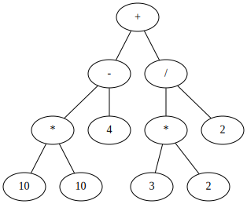

# Compilerdev Electric Boogaloo

## Goals

Create a self-compiling compiler. The language will be a dialect of C.

## Dependencies

- gcc
- make
- a linux system
- graphviz (optional)

## It can generate ASTs

## Roadmap

### Broad Scope

- [ ] Lex Tokens
- [ ] Parse Tokens
- [ ] Generate IR
- [ ] Translate to Machine Code

### Narrow Scope

- [ ] Variables
- [ ] Types
- [ ] Functions
- [ ] Loops
- [ ] Conditionals
- [ ] Arithmetic
- [ ] Operators
